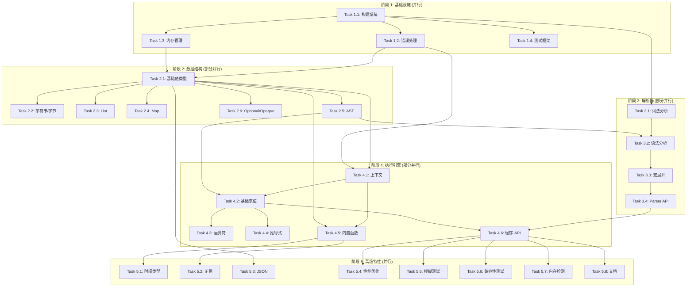

# CEL-C 实现任务拆解 - 并行执行计划

本文档将 CEL-C 的实现工作拆解为可并行执行的独立任务,适合多人团队协作开发。

---

## 📋 任务分类

任务按依赖关系分为 **5 个阶段**,每个阶段内的任务可以并行执行。

---

## 🚀 第 1 阶段: 基础设施层 (Week 1-2)

**目标**: 搭建项目基础,无相互依赖,可完全并行

### Task 1.1: 项目结构与构建系统 ⚙️
**负责人**: DevOps/构建工程师
**预计工时**: 2-3 天
**优先级**: P0 (最高)

**任务内容**:
- [ ] 创建项目目录结构 (`include/`, `src/`, `tests/`, `third_party/`)
- [ ] 编写主 `CMakeLists.txt` 配置
- [ ] 配置编译选项 (C11 标准, 编译器警告)
- [ ] 集成第三方库 (uthash, cvector, SDS)
- [ ] 配置 Debug/Release 构建模式
- [ ] 添加 AddressSanitizer 支持
- [ ] 编写 `.gitignore` 和 `README.md`

**交付物**:
- 可编译的空项目框架
- CMake 构建脚本
- 第三方库集成完成

**依赖**: 无

---

### Task 1.2: 错误处理模块 (cel_error) ❌
**负责人**: 核心库工程师 A
**预计工时**: 2-3 天
**优先级**: P0

**任务内容**:
- [ ] 定义错误码枚举 `cel_error_code_e`
- [ ] 实现 `cel_error_t` 结构体
- [ ] 实现错误创建/销毁 API
- [ ] 实现 `cel_result_t` 结构体 (Result-like 模式)
- [ ] 实现错误传播宏 (`CEL_TRY`, `CEL_UNWRAP`)
- [ ] 编写单元测试 (`test_error.c`)

**交付物**:
- `include/cel/cel_error.h`
- `src/cel_error.c`
- `tests/test_error.c`

**依赖**: Task 1.1 (构建系统)

---

### Task 1.3: 内存管理模块 (cel_memory) 💾
**负责人**: 核心库工程师 B
**预计工时**: 3-4 天
**优先级**: P0

**任务内容**:
- [ ] 实现 Arena 分配器 (`arena_t`)
- [ ] 实现 Arena 创建/销毁/分配 API
- [ ] 实现 Arena 重置功能 (`arena_reset`)
- [ ] 实现引用计数基础设施 (可选: atomic 支持)
- [ ] 实现内存池统计功能 (Debug 模式)
- [ ] 编写单元测试 (`test_memory.c`)
- [ ] 性能测试 (对比 malloc)

**交付物**:
- `include/cel/cel_memory.h`
- `src/cel_memory.c`
- `tests/test_memory.c`

**依赖**: Task 1.1 (构建系统)

---

### Task 1.4: 测试框架集成 🧪
**负责人**: 测试工程师
**预计工时**: 2 天
**优先级**: P1

**任务内容**:
- [ ] 集成 Unity 测试框架到项目
- [ ] 配置 `tests/CMakeLists.txt`
- [ ] 编写测试模板和辅助宏
- [ ] 配置 CTest 集成
- [ ] 添加测试覆盖率收集 (gcov/lcov)
- [ ] 编写测试运行脚本

**交付物**:
- `tests/unity/` (Unity 框架)
- `tests/CMakeLists.txt`
- 测试运行脚本

**依赖**: Task 1.1 (构建系统)

---

## 🏗️ 第 2 阶段: 核心数据结构 (Week 3-5)

**目标**: 实现核心值类型和 AST,部分可并行

### Task 2.1: 基础值类型 (cel_value - Part 1) 📦
**负责人**: 核心库工程师 A
**预计工时**: 5-6 天
**优先级**: P0

**任务内容**:
- [ ] 定义 `cel_value_type_e` 枚举
- [ ] 实现 `cel_value_t` 结构体 (tagged union)
- [ ] 实现基础类型创建 API:
  - `cel_value_create_null()`
  - `cel_value_create_bool()`
  - `cel_value_create_int()`
  - `cel_value_create_uint()`
  - `cel_value_create_double()`
- [ ] 实现引用计数 (`retain`/`release`)
- [ ] 实现基础类型比较 (`cel_value_equals`, `cel_value_compare`)
- [ ] 实现类型转换 (`to_string`)
- [ ] 编写单元测试

**交付物**:
- `include/cel/cel_value.h` (部分)
- `src/cel_value.c` (部分)
- `tests/test_value_basic.c`

**依赖**: Task 1.2 (错误处理), Task 1.3 (内存管理)

---

### Task 2.2: 字符串和字节类型 (cel_value - Part 2) 📝
**负责人**: 核心库工程师 B
**预计工时**: 4-5 天
**优先级**: P0

**任务内容**:
- [ ] 集成 SDS 字符串库
- [ ] 实现 `cel_string_t` 结构体
- [ ] 实现 `cel_bytes_t` 结构体
- [ ] 实现字符串创建/销毁 API
- [ ] 实现字符串比较和连接
- [ ] 实现字节数组操作
- [ ] 实现字符串 interning 池 (可选优化)
- [ ] 编写单元测试

**交付物**:
- `src/cel_string.c`
- `src/cel_bytes.c`
- `tests/test_string.c`
- `tests/test_bytes.c`

**依赖**: Task 2.1 (基础值类型)

---

### Task 2.3: 容器类型 - List (cel_value - Part 3) 📋
**负责人**: 核心库工程师 C
**预计工时**: 4-5 天
**优先级**: P0

**任务内容**:
- [ ] 实现 `cel_list_t` 结构体 (动态数组)
- [ ] 实现 List 创建/销毁 API
- [ ] 实现 List 操作:
  - `cel_list_append()`
  - `cel_list_get()`
  - `cel_list_size()`
  - `cel_list_clone()` (Copy-on-Write 支持)
- [ ] 实现 List 比较
- [ ] 实现 List 连接操作
- [ ] 编写单元测试

**交付物**:
- `src/cel_list.c`
- `tests/test_list.c`

**依赖**: Task 2.1 (基础值类型)

---

### Task 2.4: 容器类型 - Map (cel_value - Part 4) 🗺️
**负责人**: 核心库工程师 D
**预计工时**: 5-6 天
**优先级**: P0

**任务内容**:
- [ ] 实现 `cel_map_t` 结构体 (基于 uthash)
- [ ] 实现 `cel_map_key_t` (支持多类型键)
- [ ] 实现 Map 创建/销毁 API
- [ ] 实现 Map 操作:
  - `cel_map_insert()`
  - `cel_map_get()`
  - `cel_map_contains()`
  - `cel_map_size()`
- [ ] 实现跨类型键比较 (int ↔ uint)
- [ ] 实现 Map 比较
- [ ] 编写单元测试

**交付物**:
- `src/cel_map.c`
- `tests/test_map.c`

**依赖**: Task 2.1 (基础值类型)

---

### Task 2.5: AST 节点定义 (cel_ast) 🌳
**负责人**: 核心库工程师 E
**预计工时**: 4-5 天
**优先级**: P0

**任务内容**:
- [ ] 定义 `ast_node_type_e` 枚举
- [ ] 实现 `ast_node_t` 结构体 (所有节点类型)
- [ ] 实现 AST 节点创建 API:
  - `ast_create_literal()`
  - `ast_create_ident()`
  - `ast_create_call()`
  - `ast_create_select()`
  - `ast_create_index()`
  - `ast_create_conditional()`
  - `ast_create_list()`
  - `ast_create_map()`
  - `ast_create_comprehension()`
- [ ] 实现 AST 节点销毁 (递归释放)
- [ ] 实现 AST 上下文 (与 Arena 集成)
- [ ] 编写单元测试

**交付物**:
- `include/cel/cel_ast.h`
- `src/cel_ast.c`
- `tests/test_ast.c`

**依赖**: Task 2.1 (基础值类型), Task 1.3 (Arena 分配器)

---

### Task 2.6: Optional 和 Opaque 类型 ✨
**负责人**: 核心库工程师 F (可选,低优先级)
**预计工时**: 3-4 天
**优先级**: P2

**任务内容**:
- [ ] 实现 `cel_optional_t` 结构体
- [ ] 实现 Optional 创建/销毁 API
- [ ] 实现 `cel_opaque_t` 和 `cel_opaque_vtable_t`
- [ ] 实现 Opaque 类型注册机制
- [ ] 编写单元测试

**交付物**:
- `src/cel_optional.c`
- `src/cel_opaque.c`
- `tests/test_optional.c`

**依赖**: Task 2.1 (基础值类型)

**注**: 可推迟到第 4 阶段

---

## 🔍 第 3 阶段: 解析器 (Week 6-8)

**目标**: 实现词法和语法分析,部分可并行

### Task 3.1: 词法分析器 (Lexer) 🔤
**负责人**: 编译器工程师 A
**预计工时**: 5-6 天
**优先级**: P0

**任务内容**:
- [ ] 安装配置 re2c
- [ ] 编写 re2c 词法规则文件 (`lexer.re`)
- [ ] 定义 Token 类型枚举
- [ ] 实现 Token 结构体
- [ ] 实现词法状态机
- [ ] 支持所有字面量:
  - 整数 (十进制、十六进制、无符号)
  - 浮点数
  - 字符串 (转义序列)
  - 字节数组
  - 布尔值、Null
- [ ] 支持所有运算符和关键字
- [ ] 实现注释跳过 (`//`)
- [ ] 实现错误报告 (行号、列号)
- [ ] 生成 C 代码并集成到构建系统
- [ ] 编写单元测试

**交付物**:
- `src/parser/lexer.re`
- `src/parser/lexer.c` (生成)
- `src/parser/tokens.h`
- `tests/test_lexer.c`

**依赖**: Task 1.1 (构建系统)

---

### Task 3.2: 语法分析器 (Parser) 📜
**负责人**: 编译器工程师 B
**预计工时**: 6-8 天
**优先级**: P0

**任务内容**:
- [ ] 安装配置 Lemon 解析器生成器
- [ ] 编写 Lemon 语法规则文件 (`parser.y`)
- [ ] 定义运算符优先级和结合性
- [ ] 实现所有表达式规则:
  - 算术、比较、逻辑运算符
  - 三元条件
  - 字段选择和索引访问
  - 函数调用
  - 列表、Map、结构体字面量
- [ ] 实现 AST 构建逻辑
- [ ] 实现错误恢复机制
- [ ] 实现递归深度限制
- [ ] 集成词法分析器
- [ ] 生成 C 代码并集成到构建系统
- [ ] 编写单元测试

**交付物**:
- `src/parser/parser.y`
- `src/parser/parser.c` (生成)
- `tests/test_parser.c`

**依赖**: Task 3.1 (词法分析器), Task 2.5 (AST 节点)

---

### Task 3.3: 宏展开器 (Macro Expander) 🔄
**负责人**: 编译器工程师 C
**预计工时**: 4-5 天
**优先级**: P1

**任务内容**:
- [ ] 实现 `has()` 宏展开
- [ ] 实现 `all()` 宏展开
- [ ] 实现 `exists()` 宏展开
- [ ] 实现 `exists_one()` 宏展开
- [ ] 实现 `map()` 宏展开 (两种形式)
- [ ] 实现 `filter()` 宏展开
- [ ] 集成到 Parser
- [ ] 编写单元测试

**交付物**:
- `src/cel_macros.c`
- `include/cel/cel_macros.h`
- `tests/test_macros.c`

**依赖**: Task 3.2 (语法分析器)

---

### Task 3.4: 解析器 API 封装 📦
**负责人**: 编译器工程师 D
**预计工时**: 2-3 天
**优先级**: P1

**任务内容**:
- [ ] 实现 `cel_parse()` 高层 API
- [ ] 实现多错误收集和报告
- [ ] 实现源代码位置追踪
- [ ] 实现错误消息格式化
- [ ] 实现可选语法支持开关
- [ ] 编写集成测试

**交付物**:
- `include/cel/cel_parser.h`
- `src/cel_parser.c`
- `tests/test_parser_integration.c`

**依赖**: Task 3.2 (语法分析器), Task 3.3 (宏展开)

---

## ⚙️ 第 4 阶段: 执行引擎 (Week 9-12)

**目标**: 实现求值器和上下文,部分可并行

### Task 4.1: 执行上下文 (cel_context) 🗂️
**负责人**: 核心库工程师 A
**预计工时**: 4-5 天
**优先级**: P0

**任务内容**:
- [ ] 实现 `cel_context_t` 结构体
- [ ] 实现变量表 (基于 uthash)
- [ ] 实现函数注册表 (基于 uthash)
- [ ] 实现变量添加/查找 API
- [ ] 实现函数添加/查找 API
- [ ] 实现父子上下文 (作用域链)
- [ ] 实现变量解析器接口
- [ ] 编写单元测试

**交付物**:
- `include/cel/cel_context.h`
- `src/cel_context.c`
- `tests/test_context.c`

**依赖**: Task 2.1 (基础值类型), Task 1.2 (错误处理)

---

### Task 4.2: 基础求值器 (cel_eval - Part 1) 🎯
**负责人**: 核心库工程师 B
**预计工时**: 5-6 天
**优先级**: P0

**任务内容**:
- [ ] 实现核心求值函数 `cel_eval_node()`
- [ ] 实现递归深度检查
- [ ] 实现字面量求值
- [ ] ��现变量引用求值
- [ ] 实现函数调用分发
- [ ] 实现字段选择 (`obj.field`)
- [ ] 实现索引访问 (`obj[key]`)
- [ ] 实现三元条件求值 (懒惰求值)
- [ ] 编写单元测试

**交付物**:
- `include/cel/cel_eval.h`
- `src/cel_eval.c` (部分)
- `tests/test_eval_basic.c`

**依赖**: Task 4.1 (上下文), Task 2.5 (AST)

---

### Task 4.3: 运算符实现 (cel_eval - Part 2) ➕
**负责人**: 核心库工程师 C
**预计工时**: 5-6 天
**优先级**: P0

**任务内容**:
- [ ] 实现算术运算符 (`+`, `-`, `*`, `/`, `%`)
- [ ] 实现比较运算符 (`==`, `!=`, `<`, `<=`, `>`, `>=`)
- [ ] 实现逻辑运算符 (`&&`, `||`, `!`) - 短路求值
- [ ] 实现成员运算符 (`in`)
- [ ] 实现类型提升 (int/uint/float 混合运算)
- [ ] 实现溢出检查
- [ ] 实现除零检查
- [ ] 编写单元测试

**交付物**:
- `src/cel_operators.c`
- `tests/test_operators.c`

**依赖**: Task 4.2 (基础求值器)

---

### Task 4.4: 推导式求值 (cel_eval - Part 3) 🔁
**负责人**: 核心库工程师 D
**预计工时**: 4-5 天
**优先级**: P1

**任务内容**:
- [ ] 实现 Comprehension 求值算法
- [ ] 实现循环变量绑定
- [ ] 实现累加器更新
- [ ] 实现循环条件检查
- [ ] 支持 List 迭代
- [ ] 支持 Map 迭代 (可选)
- [ ] 编写单元测试

**交付物**:
- `src/cel_eval_comprehension.c`
- `tests/test_comprehension.c`

**依赖**: Task 4.2 (基础求值器), Task 4.1 (上下文)

---

### Task 4.5: 内置函数库 (cel_functions) 📚
**负责人**: 核心库工程师 E + F (可拆分子任务)
**预计工时**: 6-8 天
**优先级**: P0

**任务内容**:

**子任务 4.5.1: 集合操作函数** (工程师 E, 2 天)
- [ ] `size()`
- [ ] `contains()`

**子任务 4.5.2: 字符串操作函数** (工程师 E, 2 天)
- [ ] `startsWith()`
- [ ] `endsWith()`
- [ ] `matches()` (集成 PCRE2)
- [ ] `string()`

**子任务 4.5.3: 类型转换函数** (工程师 F, 2 天)
- [ ] `int()`
- [ ] `uint()`
- [ ] `double()`
- [ ] `bytes()`

**子任务 4.5.4: 聚合函数** (工程师 F, 1 天)
- [ ] `max()`
- [ ] `min()`

**子任务 4.5.5: Optional 函数** (工程师 F, 2 天)
- [ ] `optional.none()`
- [ ] `optional.of()`
- [ ] `hasValue()`
- [ ] `value()`
- [ ] `or()`
- [ ] `orValue()`

- [ ] 注册所有函数到默认上下文
- [ ] 编写单元测试 (每个函数)

**交付物**:
- `src/cel_functions.c`
- `tests/test_functions.c`

**依赖**: Task 4.1 (上下文), Task 2.1-2.4 (值类型)

---

### Task 4.6: 程序对象 API (cel_program) 📋
**负责人**: 核心库工程师 G
**预计工时**: 3-4 天
**优先级**: P1

**任务内容**:
- [ ] 实现 `cel_program_t` 结构体
- [ ] 实现 `cel_compile()` API
- [ ] 实现 `cel_execute()` API
- [ ] 实现 `cel_program_destroy()`
- [ ] 集成 Parser 和 Evaluator
- [ ] 实现引用追踪 API (可选)
- [ ] 编写集成测试

**交付物**:
- `include/cel/cel_program.h`
- `src/cel_program.c`
- `tests/test_program.c`

**依赖**: Task 3.4 (解析器 API), Task 4.2 (求值器)

---

## 🚀 第 5 阶段: 高级特性与优化 (Week 13-16)

**目标**: 时间类型、性能优化、文档,可并行

### Task 5.1: 时间类型支持 (可选特性) ⏰
**负责人**: 核心库工程师 H
**预计工时**: 5-6 天
**优先级**: P2

**任务内容**:
- [ ] 实现 `cel_timestamp_t` 结构体
- [ ] 实现 `cel_duration_t` 结构体
- [ ] 实现 `timestamp()` 函数 (RFC3339 解析)
- [ ] 实现 `duration()` 函数
- [ ] 实现时间戳方法 (`getFullYear`, `getMonth`, 等)
- [ ] 实现时长方法 (`getHours`, `getMinutes`, 等)
- [ ] 实现时间算术 (timestamp ± duration)
- [ ] 编写单元测试

**交付物**:
- `src/cel_timestamp.c`
- `src/cel_duration.c`
- `tests/test_time.c`

**依赖**: Task 4.5 (内置函数库)

---

### Task 5.2: 正则表达式支持 (可选特性) 🔍
**负责人**: 核心库工程师 I
**预计工时**: 3-4 天
**优先级**: P2

**任务内容**:
- [ ] 集成 PCRE2 库
- [ ] 实现 `matches()` 函数
- [ ] 实现正则缓存 (性能优化)
- [ ] 处理正则编译错误
- [ ] 编写单元测试

**交付物**:
- `src/cel_regex.c`
- `tests/test_regex.c`

**依赖**: Task 4.5 (内置函数库)

---

### Task 5.3: JSON 转换支持 (可选特性) 📄
**负责人**: 核心库工程师 J
**预计工时**: 3-4 天
**优先级**: P3

**任务内容**:
- [ ] 集成 cJSON 库
- [ ] 实现 CEL Value → JSON
- [ ] 实现 JSON → CEL Value
- [ ] 处理 Bytes 的 Base64 编码
- [ ] 编写单元测试

**交付物**:
- `src/cel_json.c`
- `include/cel/cel_json.h`
- `tests/test_json.c`

**依赖**: Task 2.1-2.4 (值类型)

---

### Task 5.4: 性能优化 ⚡
**负责人**: 性能工程师
**预计工时**: 5-6 天
**优先级**: P2

**任务内容**:
- [ ] 实现字符串 interning 池
- [ ] 实现 Copy-on-Write 优化
- [ ] 优化引用计数 (减少锁开销)
- [ ] 优化哈希表性能
- [ ] 实现 AST 节点缓存
- [ ] 性能基准测试
- [ ] 性能对比报告 (vs Rust 版本)

**交付物**:
- 性能优化补丁
- `bench/` 目录下的基准测试
- 性能报告文档

**依赖**: Task 4.6 (程序 API 完成)

---

### Task 5.5: 模糊测试 🐛
**负责人**: 测试工程师 + 安全工程师
**预计工时**: 4-5 天
**优先级**: P2

**任务内容**:
- [ ] 编写 Parser 模糊测试
- [ ] 编写 Evaluator 模糊测试
- [ ] 集成 libFuzzer 或 AFL
- [ ] 运行 24 小时模糊测试
- [ ] 修复发现的崩溃和漏洞
- [ ] 生成测试语料库

**交付物**:
- `fuzz/` 目录下的模糊测试
- 崩溃报告和修复

**依赖**: Task 4.6 (程序 API 完成)

---

### Task 5.6: 集成测试与兼容性测试 ✅
**负责人**: 测试工程师
**预计工时**: 5-6 天
**���先级**: P1

**任务内容**:
- [ ] 从 cel-rust 导出测试用例 (JSON 格式)
- [ ] 实现测试用例加载器
- [ ] 运行所有兼容性测试
- [ ] 对比输出结果
- [ ] 生成兼容性报告
- [ ] 修复不兼容问题

**交付物**:
- `tests/compatibility/` 测试套件
- 兼容性测试报告

**依赖**: Task 4.6 (程序 API 完成)

---

### Task 5.7: 内存泄漏检测 🔬
**负责人**: 测试工程师
**预计工时**: 3-4 天
**优先级**: P1

**任务内容**:
- [ ] 使用 Valgrind 运行所有测试
- [ ] 使用 AddressSanitizer 检测
- [ ] 修复所有内存泄漏
- [ ] 修复所有越界访问
- [ ] 生成内存安全报告

**交付物**:
- Valgrind 测试报告
- 内存泄漏修复补丁

**依赖**: Task 4.6 (程序 API 完成)

---

### Task 5.8: API 文档 📖
**负责人**: 技术作家 + 核心工程师
**预计工时**: 5-6 天
**优先级**: P1

**任务内容**:
- [ ] 编写 API 参考文档
- [ ] 编写用户指南
- [ ] 编写快速入门教程
- [ ] 编写示例代码 (5-10 个)
- [ ] 使用 Doxygen 生成文档
- [ ] 编写构建说明
- [ ] 编写移植指南

**交付物**:
- `docs/API.md`
- `docs/USER_GUIDE.md`
- `docs/QUICKSTART.md`
- `docs/BUILDING.md`
- `examples/` 目录下的示例

**依赖**: Task 4.6 (程序 API 完成)

---

## 📊 任务依赖关系图

---

## 👥 团队配置建议

### 最小团队 (6 人)
- **2 名核心库工程师**: 负责数据结构和执行引擎
- **2 名编译器工程师**: 负责解析器
- **1 名测试工程师**: 负责所有测试
- **1 名技术 Lead**: 统筹协调 + 文档

**预计时间**: 4-5 个月

---

### 理想团队 (10-12 人)
- **6 名核心库工程师**: A-F 各负责不同模块
- **3 名编译器工程师**: 词法、语法、宏
- **2 名测试工程师**: 单元测试 + 集成测试
- **1 名性能工程师**: 优化和基准测试
- **1 名技术作家**: 文档
- **1 名 Tech Lead**: 架构和协调

**预计时间**: 2.5-3.5 个月

---

## 📅 里程碑

### Milestone 1: MVP (Week 8)
- 基础值类型完成
- 简单解析器完成
- 基础求值器完成
- 能执行简单表达式: `1 + 2`, `"hello" + " world"`

### Milestone 2: 核心功能 (Week 12)
- 所有值类型完成
- 完整解析器完成
- 完整求值器完成
- 所有内置函数实现
- 宏系统工作

### Milestone 3: 生产就绪 (Week 16)
- 所有高级特性完成
- 测试覆盖率 > 90%
- 性能接近 Rust 版本
- 文档完整
- 0 已知 bug

---

## 🎯 关键成功因素

1. **严格的代码审查**: 每个 Task 完成后必须代码审查
2. **持续集成**: 每次提交自动运行测试
3. **每日站会**: 同步进度,识别阻塞
4. **文档先行**: API 设计阶段就编写文档
5. **性能基准**: 每个阶段都进行性能测试

---

## 📈 进度跟踪

建议使用项目管理工具:
- **Jira** 或 **Linear**: 任务跟踪
- **GitHub Projects**: 看板视图
- **Confluence**: 文档协作
- **Slack**: 团队沟通

---

祝项目成功! 🚀
