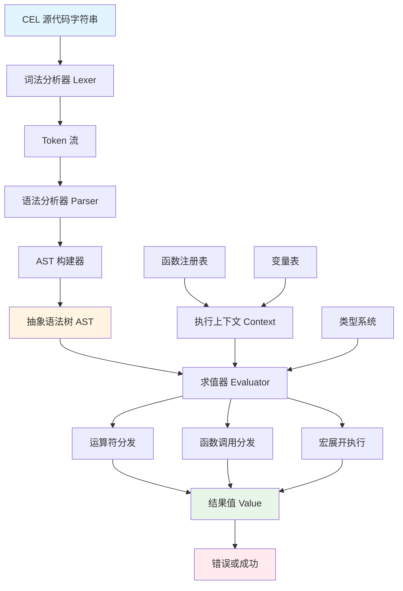
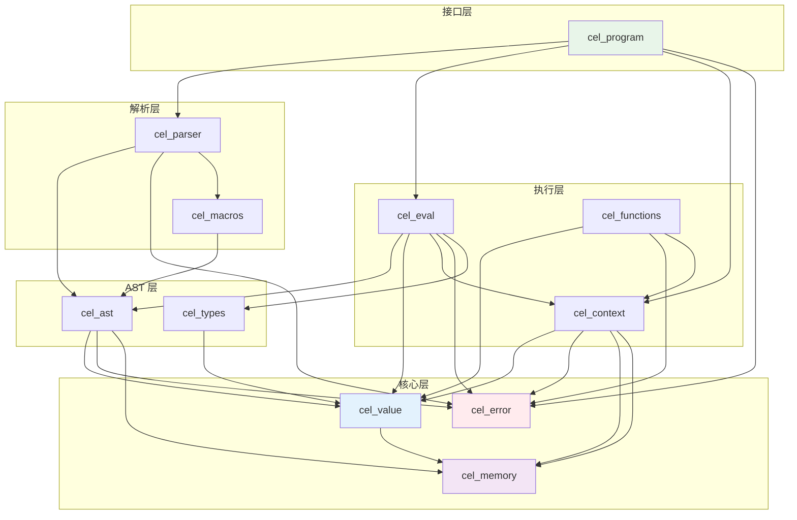
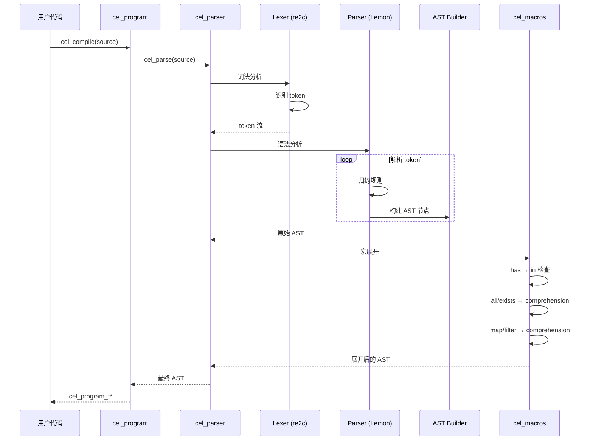
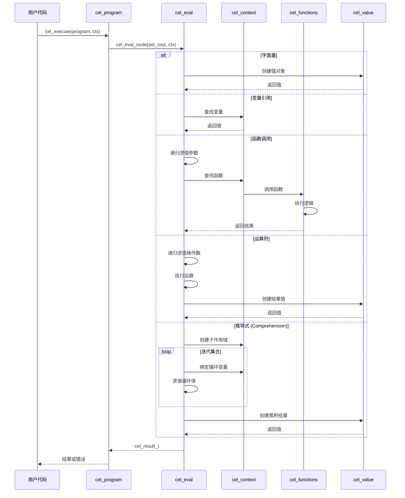
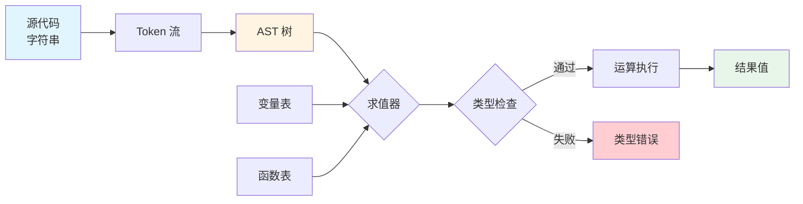

# CEL-C 语言设计文档 (第 1 部分: 概述与架构)

---

## 1. 设计概述

### 1.1 C 语言实现的设计目标

将 CEL (Common Expression Language) 从 Rust 移植到 C 语言,需要在保持功能完整性的同时,充分发挥 C 语言的特点和优势。

**核心设计目标:**

1. **功能完整性**
   - 实现 cel-rust 的所有核心功能
   - 兼容 CEL 规范
   - 支持所有数据类型、运算符和内置函数

2. **性能优化**
   - 零拷贝优化(尽可能避免不必要的内存复制)
   - 内存池/Arena 分配器减少内存碎片
   - 高效的哈希表和动态数组实现
   - 编译一次,多次执行

3. **可移植性**
   - 符合 C11/C17 标准
   - 跨平台支持 (Linux, macOS, Windows)
   - 最小化平台相关代码
   - 清晰的构建系统 (CMake)

4. **内存安全**
   - 引用计数防止内存泄漏
   - 明确的所有权语义
   - Valgrind/ASan 兼容
   - 边界检查和越界保护

5. **可扩展性**
   - 清晰的 API 边界
   - 支持自定义函数注册
   - 支持自定义类型扩展
   - 模块化设计便于维护

6. **易用性**
   - 直观的 C API 设计
   - 完善的错误处理
   - 详细的文档和示例
   - 符合 C 语言习惯

### 1.2 与 Rust 实现的主要差异

| 方面 | Rust 实现 | C 实现 | 原因 |
|------|-----------|--------|------|
| **内存管理** | `Arc<T>` 原子引用计数 | 普通引用计数 + 互斥锁(多线程) | C 无原子操作标准库,需手动实现 |
| **错误处理** | `Result<T, E>` 枚举 | 返回码 + 错误结构体 | C 无 Result 类型,采用传统模式 |
| **类型系统** | 强类型 + 泛型 | Tagged union + void* | C 无泛型,使用 union 和类型标签 |
| **字符串** | `Arc<String>` UTF-8 保证 | `struct` 包装 char* + 长度 | C 字符串需手动管理 |
| **容器** | `Vec<T>`, `BTreeMap<K,V>` | 动态数组 + 哈希表(uthash) | 使用成熟的 C 库 |
| **并发安全** | 编译期保证 | 运行时检查 + 文档约定 | C 无编译期所有权检查 |
| **解析器** | ANTLR4 (antlr4rust) | re2c + Lemon/手写 | 选择更适合 C 的工具链 |
| **模式匹配** | `match` 表达式 | `switch` + 函数指针表 | C 无模式匹配,用 switch 模拟 |

**设计哲学差异:**

- **Rust**: 零成本抽象,编译期保证,所有权系统
- **C**: 显式控制,运行时灵活,程序员负责

### 1.3 目标 C 标准

**主标准: C11 (ISO/IEC 9899:2011)**

**原因:**
1. 广泛支持 (GCC 4.7+, Clang 3.1+, MSVC 2015+)
2. 提供有用的特性:
   - `_Alignas`, `_Alignof` - 内存对齐控制
   - `_Static_assert` - 编译期断言
   - `_Generic` - 类型泛型宏
   - `<stdatomic.h>` - 原子操作(可选使用)
   - `<threads.h>` - 线程支持(可选使用)
3. 向后兼容 C99

**备选标准: C17 (ISO/IEC 9899:2018)**

C17 是 C11 的 Bug 修复版,无新特性,完全兼容。

**避免使用:**
- C23 新特性(太新,编译器支持不足)
- 编译器特定扩展(GNU extensions, MSVC extensions)

**编译器目标:**
- GCC 7.0+
- Clang 6.0+
- MSVC 2019+

### 1.4 第三方库选型策略

**选型原则:**

1. **成熟稳定**: 生产环境验证,活跃维护
2. **许可友好**: MIT, BSD, Apache 2.0 等宽松许可
3. **零依赖优先**: Header-only 或独立库优先
4. **跨平台**: 支持主流操作系统
5. **性能优秀**: 经过性能测试和优化
6. **API 简洁**: 易于集成和使用

**库选型决策表:**

| 功能 | 候选库 | 最终选择 | 理由 |
|------|--------|----------|------|
| 哈希表 | glib, uthash, khash | **uthash** | Header-only, 零依赖, API 简单 |
| 动态数组 | cvector, stretchy_buffer | **cvector** | Header-only, 类型安全宏 |
| 字符串 | bstring, SDS | **SDS** | Redis 使用, 性能优秀, 二进制安全 |
| 正则表达式 | PCRE2, Oniguruma | **PCRE2** | 标准库, 功能完整, 性能好 |
| JSON | cJSON, jansson, yajl | **cJSON** | 轻量, 易用, 无依赖 |
| 时间处理 | libc time.h | **time.h + 自定义** | 标准库足够, 减少依赖 |
| 内存池 | talloc, apr_pool | **自实现 Arena** | 简单需求, 避免重依赖 |
| 测试框架 | Unity, Check, cmocka | **Unity** | ThrowTheSwitch 出品, 嵌入式友好 |
| 构建系统 | Make, CMake, Meson | **CMake** | 跨平台标准, 生态完善 |
| 词法分析 | Flex, re2c | **re2c** | 更快, 无依赖, 生成纯 C |
| 语法分析 | Bison, Lemon | **Lemon** | SQLite 使用, 线程安全 |

---

## 2. 整体架构设计

### 2.1 系统架构图



**架构层次:**

1. **输入层**: 源代码字符串
2. **解析层**: Lexer + Parser → AST
3. **执行层**: Evaluator + Context → Value
4. **输出层**: 结果值或错误

### 2.2 模块划分

#### 模块列表

| 模块名 | 文件 | 职责 |
|--------|------|------|
| **cel_value** | `cel_value.h/c` | 值类型定义、创建、销毁、引用计数 |
| **cel_ast** | `cel_ast.h/c` | AST 节点定义、构建、遍历、销毁 |
| **cel_parser** | `cel_parser.h/c` | 词法语法分析、AST 构建 |
| **cel_eval** | `cel_eval.h/c` | AST 求值引擎、运算符实现 |
| **cel_context** | `cel_context.h/c` | 执行上下文、变量/函数管理 |
| **cel_functions** | `cel_functions.h/c` | 内置函数实现 |
| **cel_types** | `cel_types.h/c` | 类型系统、类型检查 |
| **cel_error** | `cel_error.h/c` | 错误码、错误消息处理 |
| **cel_memory** | `cel_memory.h/c` | 内存管理、引用计数、Arena 分配器 |
| **cel_macros** | `cel_macros.h/c` | 宏展开逻辑(has, all, exists, map, filter) |
| **cel_program** | `cel_program.h/c` | 程序对象(编译结果)、执行接口 |

#### 核心模块详解

**cel_value** (值类型模块)
- 定义所有 CEL 值类型的 C 表示
- 提供值的创建、销毁、引用计数
- 实现值的比较、转换

**cel_ast** (AST 模块)
- 定义所有 AST 节点类型
- 提供 AST 构建和遍历 API
- 管理 AST 节点的内存

**cel_parser** (解析器模块)
- 词法分析: 字符串 → Token 流
- 语法分析: Token 流 → AST
- 宏展开: 宏语法 → Comprehension AST
- 错误报告

**cel_eval** (求值器模块)
- 树遍历求值算法
- 运算符实现(算术、逻辑、比较)
- 函数调用分发
- 短路求值优化

**cel_context** (上下文模块)
- 变量存储和查找
- 函数注册表
- 作用域链(父子上下文)
- 变量解析器接口

**cel_functions** (内置函数模块)
- 实现所有 CEL 标准函数
- size, contains, startsWith, endsWith
- 类型转换函数
- 时间日期函数

### 2.3 模块依赖关系图



**依赖层次 (从底向上):**

1. **基础层**: `cel_memory`, `cel_error` (无依赖)
2. **核心层**: `cel_value` (依赖基础层)
3. **结构层**: `cel_ast`, `cel_types` (依赖核心层)
4. **解析层**: `cel_parser`, `cel_macros` (依赖结构层)
5. **执行层**: `cel_eval`, `cel_context`, `cel_functions` (依赖结构层)
6. **接口层**: `cel_program` (依赖所有层)

### 2.4 编译流程图



### 2.5 执行流程图



### 2.6 数据流概览



### 2.7 目录结构设计

```
cel-c/
├── CMakeLists.txt              # 主构建文件
├── README.md                   # 项目说明
├── LICENSE                     # MIT 许可证
│
├── include/                    # 公开头文件
│   └── cel/
│       ├── cel.h              # 主头文件(包含所有公开 API)
│       ├── cel_program.h      # 程序编译/执行 API
│       ├── cel_context.h      # 上下文 API
│       ├── cel_value.h        # 值类型 API
│       ├── cel_error.h        # 错误处理 API
│       └── cel_types.h        # 类型定义
│
├── src/                        # 源文件
│   ├── cel_value.c
│   ├── cel_ast.c
│   ├── cel_parser.c
│   ├── cel_eval.c
│   ├── cel_context.c
│   ├── cel_functions.c
│   ├── cel_types.c
│   ├── cel_error.c
│   ├── cel_memory.c
│   ├── cel_macros.c
│   ├── cel_program.c
│   │
│   ├── parser/                 # 解析器实现
│   │   ├── lexer.re           # re2c 词法定义
│   │   ├── lexer.c            # 生成的词法分析器
│   │   ├── parser.y           # Lemon 语法定义
│   │   ├── parser.c           # 生成的语法分析器
│   │   └── parser_internal.h  # 解析器内部头文件
│   │
│   └── internal/               # 内部头文件
│       ├── cel_ast_internal.h
│       ├── cel_eval_internal.h
│       └── cel_memory_internal.h
│
├── third_party/                # 第三方库
│   ├── uthash/                # 哈希表(头文件)
│   │   └── uthash.h
│   ├── cvector/               # 动态数组(头文件)
│   │   └── cvector.h
│   ├── sds/                   # 字符串库
│   │   ├── sds.h
│   │   └── sds.c
│   └── cJSON/                 # JSON 库(可选)
│       ├── cJSON.h
│       └── cJSON.c
│
├── tests/                      # 测试
│   ├── CMakeLists.txt
│   ├── test_value.c
│   ├── test_parser.c
│   ├── test_eval.c
│   ├── test_functions.c
│   └── unity/                 # Unity 测试框架
│       ├── unity.h
│       └── unity.c
│
├── examples/                   # 示例程序
│   ├── simple.c               # 简单表达式求值
│   ├── variables.c            # 变量使用
│   ├── functions.c            # 自定义函数
│   └── CMakeLists.txt
│
├── bench/                      # 性能测试
│   ├── bench_parser.c
│   ├── bench_eval.c
│   └── CMakeLists.txt
│
└── docs/                       # 文档
    ├── API.md                 # API 文档
    ├── BUILDING.md            # 构建说明
    └── PORTING.md             # 移植指南
```

### 2.8 构建系统设计 (CMake)

**主 CMakeLists.txt 结构:**

```cmake
cmake_minimum_required(VERSION 3.15)
project(cel-c VERSION 0.1.0 LANGUAGES C)

# C 标准
set(CMAKE_C_STANDARD 11)
set(CMAKE_C_STANDARD_REQUIRED ON)

# 编译选项
set(CMAKE_C_FLAGS "${CMAKE_C_FLAGS} -Wall -Wextra -pedantic")
set(CMAKE_C_FLAGS_DEBUG "${CMAKE_C_FLAGS_DEBUG} -g -O0 -fsanitize=address")
set(CMAKE_C_FLAGS_RELEASE "${CMAKE_C_FLAGS_RELEASE} -O3 -DNDEBUG")

# 选项
option(CEL_BUILD_TESTS "Build tests" ON)
option(CEL_BUILD_EXAMPLES "Build examples" ON)
option(CEL_BUILD_SHARED "Build shared library" OFF)
option(CEL_ENABLE_REGEX "Enable regex support" ON)
option(CEL_ENABLE_CHRONO "Enable time/duration support" ON)
option(CEL_ENABLE_JSON "Enable JSON support" OFF)

# 库目标
add_library(cel ${CEL_SOURCES})
target_include_directories(cel PUBLIC include)
target_include_directories(cel PRIVATE src/internal)

# 链接第三方库
if(CEL_ENABLE_REGEX)
    find_package(PCRE2 REQUIRED)
    target_link_libraries(cel PRIVATE PCRE2::8bit)
endif()

# 测试
if(CEL_BUILD_TESTS)
    enable_testing()
    add_subdirectory(tests)
endif()

# 示例
if(CEL_BUILD_EXAMPLES)
    add_subdirectory(examples)
endif()
```

---

## 3. 设计原则与约定

### 3.1 命名约定

**类型命名:**
- 结构体: `cel_xxx_t` (如 `cel_value_t`, `cel_context_t`)
- 枚举: `cel_xxx_e` (如 `cel_type_e`, `cel_error_code_e`)
- 函数指针类型: `cel_xxx_fn` (如 `cel_function_fn`)

**函数命名:**
- 公开 API: `cel_module_action()` (如 `cel_value_create_int()`)
- 内部函数: `cel_module_internal_action()` (如 `cel_parser_internal_tokenize()`)
- 静态函数: `module_action()` (如 `parser_build_ast()`)

**宏命名:**
- 大写下划线: `CEL_XXX` (如 `CEL_MAX_RECURSION_DEPTH`)

**变量命名:**
- 小写下划线: `variable_name` (如 `token_count`)

### 3.2 错误处理约定

**返回码模式:**
```c
// 成功返回 CEL_OK (0)
// 失败返回错误码 (非零)
cel_error_code_e cel_some_function(cel_value_t* result);
```

**错误信息输出参数:**
```c
// 使用输出参数返回详细错误
cel_error_code_e cel_parse(
    const char* source,
    cel_ast_t** ast,        // 输出: AST
    cel_error_t** error     // 输出: 错误详情
);
```

### 3.3 内存管理约定

**所有权规则:**
1. **创建者拥有**: `cel_xxx_create()` 返回的对象由调用者拥有
2. **引用计数**: 使用 `cel_xxx_retain()` 增加引用, `cel_xxx_release()` 减少引用
3. **借用**: 函数参数一般是借用,不改变引用计数
4. **转移所有权**: 明确在文档中说明

**示例:**
```c
// 创建 (调用者拥有)
cel_value_t* val = cel_value_create_int(42);

// 增加引用 (共享所有权)
cel_value_retain(val);
context_add_variable(ctx, "x", val);

// 减少引用 (释放所有权)
cel_value_release(val);  // 引用计数 = 1
cel_value_release(val);  // 引用计数 = 0, 销毁
```

### 3.4 线程安全约定

**线程安全组件:**
- `cel_program_t`: 可多线程共享(只读)
- `cel_value_t`: 不可变值可共享

**非线程安全组件:**
- `cel_context_t`: 每线程独立
- `cel_ast_t`: 构建后不可变

**文档标注:**
```c
/**
 * @brief 编译 CEL 表达式
 * @threadsafe 线程安全
 */
cel_program_t* cel_compile(const char* source);

/**
 * @brief 执行程序
 * @threadsafe_with_different_contexts
 *            不同 context 可并发执行
 */
cel_result_t cel_execute(cel_program_t* prog, cel_context_t* ctx);
```

---

## 总结

本部分介绍了 CEL-C 的设计概述和整体架构:

1. **设计目标**: 功能完整、性能优化、可移植、内存安全、可扩展
2. **与 Rust 差异**: 内存管理、错误处理、类型系统等方面的适配
3. **技术选型**: C11 标准, 精选第三方库
4. **模块划分**: 11 个核心模块,清晰的职责边界
5. **依赖关系**: 分层架构,自底向上构建
6. **流程设计**: 编译流程和执行流程的详细描述
7. **设计约定**: 命名、错误处理、内存管理、线程安全

下一部分将详细设计核心数据结构。
